<!-- Math hiển thị tốt nhất trên GitHub (hỗ trợ LaTeX) hoặc VS Code Markdown Preview Enhanced -->

# So sánh **BiLSTM** và **Transformer** cho phát hiện ngôn từ thù ghét tiếng Việt (ViHSD)

> Đồ án môn **Toán cho AI** — Xây dựng, huấn luyện và **so sánh** hai kiến trúc học sâu trên cùng
> một bộ dữ liệu; phân tích **vì sao** dùng từng phương pháp xử lý dữ liệu / huấn luyện bằng các
> thí nghiệm **ablation** (cắt bỏ) và **biểu đồ minh hoạ**, kèm **nền tảng toán học**.

---

## Mục lục
1. [Tổng quan dự án](#1-tổng-quan-dự-án)
2. [Cấu trúc thư mục](#2-cấu-trúc-thư-mục)
3. [Cách chạy](#3-cách-chạy)
4. [Dữ liệu & Phân tích khám phá (EDA)](#4-dữ-liệu--phân-tích-khám-phá-eda)
5. [Phương pháp xử lý dữ liệu — lý do & lý thuyết](#5-phương-pháp-xử-lý-dữ-liệu--lý-do--lý-thuyết)
6. [Hai kiến trúc & nền tảng toán học](#6-hai-kiến-trúc--nền-tảng-toán-học)
7. [Phương pháp huấn luyện (tuning)](#7-phương-pháp-huấn-luyện-tuning)
8. [Giám sát quá trình huấn luyện](#8-giám-sát-quá-trình-huấn-luyện)
9. [Kết quả đánh giá](#9-kết-quả-đánh-giá)
10. [Ablation — "có" vs "không" dùng phương pháp](#10-ablation--có-vs-không-dùng-phương-pháp)
11. [Kết luận & hướng phát triển](#11-kết-luận--hướng-phát-triển)
12. [Tài liệu tham khảo](#12-tài-liệu-tham-khảo)

---

## 1. Tổng quan dự án

**Bài toán.** Phân loại **3 lớp** một bình luận mạng xã hội tiếng Việt:

| Nhãn | Tên | Ý nghĩa |
|:---:|:---|:---|
| `0` | **CLEAN** | bình thường, không công kích |
| `1` | **OFFENSIVE** | công kích / xúc phạm |
| `2` | **HATE** | ngôn từ thù ghét |

Đây là bộ **ViHSD** (Vietnamese Hate Speech Detection). Mục tiêu của đồ án **không chỉ** là đạt
điểm cao, mà là **so sánh có hệ thống**:

- **Hai kiến trúc:** `BiLSTM` (hồi quy) vs `Transformer Encoder` (self-attention) — *cài từ đầu*,
  **dùng chung** mọi thứ trừ cách trộn thông tin theo thời gian ⇒ so sánh **công bằng** về kiến trúc.
- **Các phương pháp xử lý dữ liệu / huấn luyện:** mỗi phương pháp được kiểm chứng bằng thí nghiệm
  **ablation** — bật/tắt đúng một yếu tố để thấy nó **đóng góp gì**.

**Triết lý so sánh công bằng.** Ta **không** dùng mô hình tiền huấn luyện (như PhoBERT) cho phía
Transformer, vì khi đó sẽ so *"kiến thức tiền huấn luyện"* chứ không phải *"kiến trúc"*. Cả hai mô
hình ở đây đều học **từ đầu** trên cùng tập ViHSD, cùng lớp nhúng, cùng cách gộp chuỗi, cùng
optimizer/scheduler/loss ⇒ khác biệt quan sát được là do **bản chất kiến trúc**.

---

## 2. Cấu trúc thư mục

```
.
├── train.csv / dev.csv / test.csv      # dữ liệu ViHSD (free_text, label_id)
├── src/
│   ├── config.py          # mọi siêu tham số (1 nơi duy nhất) + seed + device
│   ├── preprocessing.py   # pipeline làm sạch tiếng Việt (teencode, emoji, NFC...)
│   ├── vocab.py           # từ điển token->index, <pad>/<unk>, ngưỡng min_freq, OOV
│   ├── dataset.py         # nạp dữ liệu, padding + masking, DataLoader, class-weight
│   ├── models.py          # BiLSTM & Transformer-Encoder (self-attention cài tay)
│   ├── engine.py          # vòng lặp train/eval, focal/weighted-CE, warmup, early-stop
│   ├── plots.py           # toàn bộ biểu đồ giám sát & so sánh
│   └── eda.py             # phân tích khám phá dữ liệu
├── run_all.py             # CHẠY TẤT CẢ: EDA + train 2 mô hình + ablation -> lưu metrics/figs
├── build_notebook.py      # sinh notebook trình bày từ metrics đã lưu
├── LSTM_vs_Transformer.ipynb   # notebook báo cáo (vẽ lại mọi biểu đồ tại chỗ)
├── requirements.txt
├── results/
│   ├── figures/*.png      # tất cả biểu đồ (đánh số 01..19)
│   ├── metrics/*.json     # số liệu thô (để tái lập biểu đồ/bảng)
│   └── checkpoints/*.pt   # trọng số mô hình tốt nhất
└── README.md
```

---

## 3. Cách chạy

```bash
# 1) Môi trường (Python 3.10–3.12, có GPU NVIDIA + CUDA khuyến nghị)
python -m venv .venv && source .venv/bin/activate
pip install -r requirements.txt

# 2) Chạy toàn bộ thí nghiệm (EDA + huấn luyện + ablation) -> sinh results/
python run_all.py            # đầy đủ (~25–30 phút trên RTX 4060)
python run_all.py --quick    # rút gọn (3 epoch) để kiểm tra pipeline

# 3) Sinh & xem notebook báo cáo (nạp lại metrics, vẽ biểu đồ tại chỗ)
python build_notebook.py
jupyter notebook LSTM_vs_Transformer.ipynb
```

> Notebook mặc định `RUN_TRAINING=False`: chỉ **nạp** kết quả đã lưu và vẽ lại biểu đồ (nhanh, ổn
> định). Đặt `True` để huấn luyện lại từ đầu ngay trong notebook.

---

## 4. Dữ liệu & Phân tích khám phá (EDA)

### 4.1 Mất cân bằng lớp — đặc điểm chi phối toàn bộ thiết kế

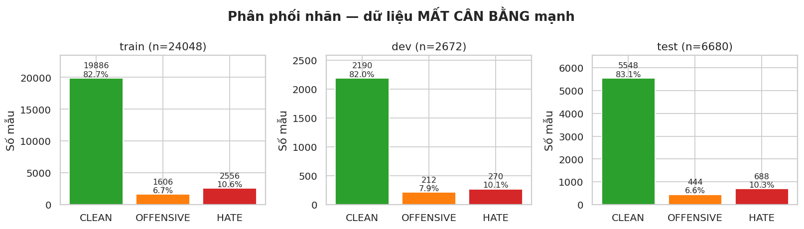

Lớp `CLEAN` áp đảo (~83%), trong khi hai lớp **cần phát hiện** chỉ chiếm phần nhỏ (`OFFENSIVE`
~7%, `HATE` ~11%).

> **Vì sao đây là vấn đề (toán học).** Một bộ phân loại tầm thường *"luôn đoán CLEAN"* đạt
> **accuracy ≈ 83%** nhưng **recall = 0** cho mọi câu thù ghét — hoàn toàn vô dụng. Hàm mất mát
> cross-entropy chuẩn tối thiểu hoá lỗi *trung bình trên mẫu*, nên bị lớp đa số kéo về phía dự
> đoán CLEAN. ⇒ Hai đối sách: **(i)** đổi thước đo sang **macro-F1**; **(ii)** đổi loss sang
> **weighted/focal** (mục 7). Bỏ qua mất cân bằng = mô hình "mù" với lớp thiểu số (chứng minh ở §10.1).

**Thước đo chính — macro-F1** (trung bình **không trọng số** F1 của 3 lớp):

$$
\text{macro-F1}=\frac{1}{K}\sum_{c=1}^{K} F1_c,\qquad
F1_c=\frac{2 P_c R_c}{P_c+R_c},\quad
P_c=\frac{TP_c}{TP_c+FP_c},\quad R_c=\frac{TP_c}{TP_c+FN_c}.
$$

Vì lấy trung bình **không trọng số**, lớp `HATE` (11%) có tiếng nói **ngang** lớp `CLEAN` (83%).

### 4.2 Độ dài câu — chọn `max_len`

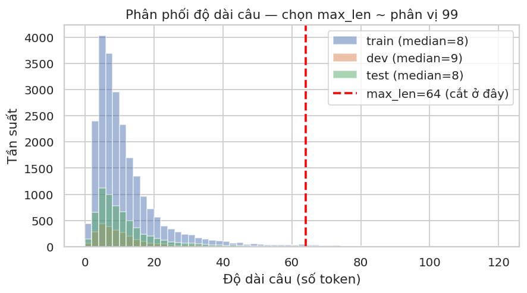

Đa số câu ngắn (trung vị ~8 token) nhưng có đuôi dài. Ta chọn **`max_len = 64`** (~phân vị 99):
cắt câu dài hơn, đệm câu ngắn hơn. Lý do toán học: self-attention có chi phí **$O(L^2)$** theo độ
dài $L$; chọn `max_len` ở phân vị 99 giữ ~99% thông tin mà không trả giá tính toán cho 1% câu cực dài.

### 4.3 Nhiễu đặc thù tiếng Việt → động lực tiền xử lý

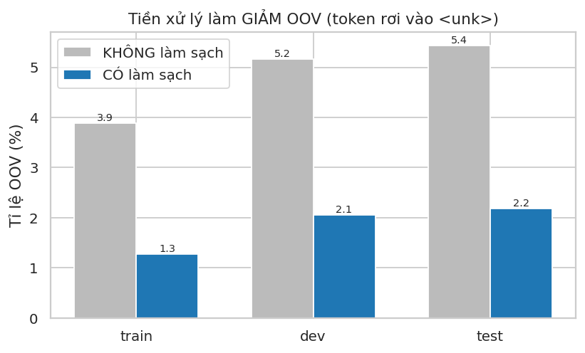
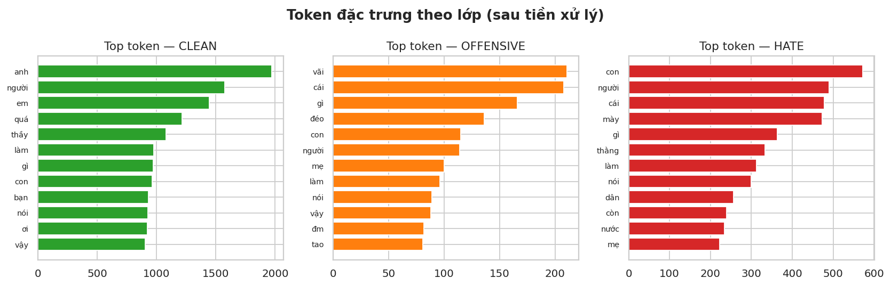

Dữ liệu là bình luận thật: teencode (`ko`, `dc`, `vl`), emoji/emoticon (`:))`, `❤️`), kéo dài ký
tự (`quááá`, `=))))`). Trong nhóm token tần suất cao có cả `:))` và `ko` — tức **nhiễu là tín
hiệu phổ biến**, không thể bỏ qua. (Chi tiết tác động ở §5 và §10.3.)

---

## 5. Phương pháp xử lý dữ liệu — lý do & lý thuyết

Pipeline trong [`src/preprocessing.py`](src/preprocessing.py). Mỗi bước có **lý do** rõ ràng và
**rủi ro nếu bỏ**:

| Bước | Việc làm | Vì sao dùng | Nếu **KHÔNG** dùng |
|:---|:---|:---|:---|
| **Chuẩn hoá Unicode NFC** | gộp ký tự + dấu thành 1 mã | tiếng Việt có cả dạng *dựng sẵn* và *tổ hợp* cho cùng một chữ | "à" ở 2 dạng → **2 token khác nhau**, phân mảnh vốn từ |
| **Lowercase** | hạ chữ thường | giảm phân mảnh | "HATE"≠"hate"≠"Hate" → 3 token |
| **URL / @mention / sđt → token** | `<url> <user> <phone>` | các chuỗi này vô hạn dạng, chỉ là nhiễu | mỗi link/sđt là **một token lạ** → OOV bùng nổ |
| **Emoticon / emoji → token cảm xúc** | `:))`→`<troll_emo>`, `❤️`→`<emoji>` | **giữ sắc thái** (mỉa mai, cười cợt — rất quan trọng với HATE) | mất tín hiệu cảm xúc, hoặc thành OOV |
| **Rút gọn kéo dài** | `quááá`→`quá` | gộp biến thể chính tả | `quá, quáá, quááá` = 3 token riêng |
| **Chuẩn hoá teencode** | `ko`→`không`, `dc`→`được`, `vs`→`với` | gộp về dạng chuẩn (tần suất cao!) | vốn từ phân mảnh, OOV cao, mất liên hệ ngữ nghĩa |

### Vì sao **OOV** là thước đo cốt lõi của tiền xử lý

Mỗi token được tra một vector nhúng riêng $E_i\in\mathbb R^{d}$ (ma trận $E\in\mathbb R^{V\times d}$).
Token **ngoài từ điển** (Out-Of-Vocabulary) bị thay bằng **một** vector `<unk>` *dùng chung*:

$$
\text{token } t \;\longmapsto\; \begin{cases} E[\,\text{stoi}(t)\,] & t\in V\\[2pt] E[\,\text{idx}(\texttt{<unk>})\,] & t\notin V \end{cases}
$$

OOV cao ⇒ nhiều token bị "xoá nhoà" thành cùng một vector ⇒ mô hình **mất thông tin đầu vào** ngay
trước khi học. Biểu đồ §4.3 cho thấy pipeline làm sạch **giảm mạnh OOV** (chi tiết số liệu ở §10.3),
nhờ gộp teencode/emoji/biến thể về dạng chuẩn đã có trong từ điển.

> **Đánh đổi cần lưu ý (giới hạn của chuẩn hoá teencode).** Từ điển teencode có một số ánh xạ
> **một ký tự** (vd `k`→`không`, `t`→`tao`, `m`→`mày`, `r`→`rồi`). Đây là dao hai lưỡi: chúng bắt
> đúng văn phong chat/toxic (rất hữu ích cho `HATE`/`OFFENSIVE`), nhưng cũng có thể **chuẩn hoá quá
> tay** khi token một ký tự thực ra là chữ cái đầu tên riêng (`chi B`→`chi bạn`) hay đơn vị (`500 k`).
> Vì tiếng Việt đơn âm, token một ký tự xuất hiện khá nhiều ⇒ đây là **lựa chọn thiết kế** ưu tiên
> phủ teencode, chấp nhận một tỉ lệ nhỏ sai. Có thể siết lại bằng ràng buộc ngữ cảnh (chỉ map khi
> token đứng riêng, không kèm số) nếu cần độ chính xác cao hơn.

### Từ điển & ngưỡng tần suất `min_freq`

Ta giữ token xuất hiện **≥ 2 lần** (`min_freq = 2`). Đây là **đánh đổi**:

- `min_freq` thấp → vocab lớn, nhiều tham số nhúng, dễ **overfit** token hiếm (chỉ thấy 1 lần).
- `min_freq` cao → vocab nhỏ, nhiều **OOV** → mất thông tin.

Hai token đặc biệt: `<pad>` (chỉ số 0, token đệm — **bị che**) và `<unk>` (chỉ số 1).

### Padding & Masking (lý thuyết)

Câu dài ngắn khác nhau nhưng tensor phải là khối chữ nhật $B\times L$. Ta **đệm** `<pad>` cho đủ
độ dài, đồng thời truyền **mask** $m\in\{0,1\}^{B\times L}$ ($m_{ij}=1$ nếu token thật):

- **Gộp chuỗi có che:** $\displaystyle \text{mean}=\frac{\sum_j m_{ij}\,h_{ij}}{\sum_j m_{ij}}$ —
  bỏ qua vị trí đệm, tránh làm loãng biểu diễn.
- **Transformer:** dùng `key_padding_mask` để gán điểm attention tại vị trí đệm bằng $-\infty$ ⇒
  $\operatorname{softmax}\to 0$ ⇒ pad **không** đóng góp.
- *(Lưu ý kỹ thuật: câu rỗng sau làm sạch được thay bằng đúng một token `<unk>` để mask không bao
  giờ toàn 0 — tránh phép `max` trên tập rỗng gây tràn số → NaN.)*

---

## 6. Hai kiến trúc & nền tảng toán học

Cả hai **dùng chung**: nhúng $E\in\mathbb R^{V\times 200}$, gộp **masked mean+max pooling**, đầu MLP
phân loại. **Khác biệt duy nhất** là cách trộn thông tin giữa các token.

### 6.1 BiLSTM (Long Short-Term Memory, hai chiều)

LSTM xử lý **tuần tự**; tại mỗi bước $t$ cập nhật **ô nhớ** $c_t$ và **trạng thái ẩn** $h_t$ qua các
*cổng* (gate):

$$
\begin{aligned}
f_t &= \sigma(W_f[h_{t-1},x_t]+b_f) && \text{(cổng quên)}\\
i_t &= \sigma(W_i[h_{t-1},x_t]+b_i) && \text{(cổng nạp)}\\
\tilde c_t &= \tanh(W_c[h_{t-1},x_t]+b_c) && \text{(ứng viên)}\\
c_t &= f_t\odot c_{t-1} + i_t\odot \tilde c_t && \text{(ô nhớ)}\\
o_t &= \sigma(W_o[h_{t-1},x_t]+b_o), \quad h_t = o_t\odot\tanh(c_t) && \text{(đầu ra)}
\end{aligned}
$$

**Vì sao LSTM giảm triệt tiêu gradient?** Đạo hàm ô nhớ qua thời gian là
$\frac{\partial c_t}{\partial c_{t-1}}=f_t$. Khi cổng quên $f_t\approx 1$, gradient truyền ngược
gần như **không bị nhân nhỏ dần** — tạo "đường cao tốc" cho thông tin xa, khắc phục điểm yếu của
RNN thuần (gradient $\propto \prod_t W$ → triệt tiêu/bùng nổ theo cấp số nhân).

**Hai chiều (Bi):** chạy một LSTM xuôi và một LSTM ngược, nối
$h_t=[\overrightarrow{h_t};\overleftarrow{h_t}]$ ⇒ mỗi vị trí "thấy" cả ngữ cảnh **trái và phải**.
Chi phí **$O(L)$** nhưng **tuần tự** (bước $t$ chờ bước $t-1$) → khó song song theo thời gian.

### 6.2 Transformer Encoder (Self-Attention)

Mọi token "nhìn" mọi token **song song**. Lõi là **Scaled Dot-Product Attention**:

$$
\text{Attention}(Q,K,V)=\operatorname{softmax}\!\Big(\frac{QK^\top}{\sqrt{d_k}}\Big)V,
\qquad Q=XW_Q,\; K=XW_K,\; V=XW_V.
$$

- $QK^\top$ : ma trận $L\times L$ đo **độ tương hợp** mọi cặp token (query–key).
- Chia $\sqrt{d_k}$ : giữ phương sai của tích vô hướng ổn định (~1), tránh softmax **bão hoà**
  (gradient ~ 0) khi $d_k$ lớn.
- **Multi-Head:** chạy $h$ "đầu" song song trên các không gian con $d_k=d/h$ rồi **nối**:
  $\text{MHA}(X)=[\,\text{head}_1;\dots;\text{head}_h\,]W_O$. Mỗi đầu học **một kiểu quan hệ** khác
  nhau (cú pháp, ngữ nghĩa, từ phủ định...).

Mỗi lớp encoder (kiểu **Pre-LN**, ổn định hơn Post-LN):

$$
x \leftarrow x + \text{MHA}(\text{LN}(x)), \qquad
x \leftarrow x + \text{FFN}(\text{LN}(x)),\quad \text{FFN}(z)=W_2\,\text{GELU}(W_1 z).
$$

Chi phí **$O(L^2 d)$** (đắt hơn theo độ dài) nhưng **song song hoàn toàn**; **đường đi thông tin**
giữa hai token bất kỳ chỉ dài **$O(1)$** (so với $O(L)$ của LSTM) ⇒ về lý thuyết bắt **phụ thuộc
xa** tốt hơn.

### 6.3 Positional Encoding — vì sao **bắt buộc** với Transformer

Self-attention **bất biến hoán vị** (permutation-invariant): nếu hoán vị thứ tự token đầu vào, đầu
ra chỉ bị hoán vị tương ứng — mô hình **không biết** thứ tự. Khi đó *"tôi ghét bạn"* và *"bạn ghét
tôi"* có **cùng** biểu diễn tập hợp, dù nghĩa trái ngược. Ta **cộng** mã vị trí sin/cos vào nhúng:

$$
PE_{(pos,2i)}=\sin\!\Big(\frac{pos}{10000^{2i/d}}\Big),\qquad
PE_{(pos,2i+1)}=\cos\!\Big(\frac{pos}{10000^{2i/d}}\Big).
$$

Tần số giảm theo chiều $i$ tạo "đồng hồ nhiều kim" mã hoá vị trí tuyệt đối **và** tương đối
(vì $PE_{pos+k}$ là phép quay tuyến tính của $PE_{pos}$). **LSTM không cần** positional encoding vì
thứ tự đã ngầm nằm trong tính tuần tự. Tác động thực nghiệm: §10.2.

---

## 7. Phương pháp huấn luyện (tuning)

| Thành phần | Lựa chọn | Lý do |
|:---|:---|:---|
| Optimizer | **AdamW** (`lr=1e-3`, `weight_decay=1e-2`) | thích nghi tốc độ học từng tham số; weight-decay tách rời (regularization) |
| Loss | **Weighted Cross-Entropy** (+ tuỳ chọn Focal) | chống mất cân bằng (xem dưới) |
| Lịch học | **Warmup 10% + decay tuyến tính** | ổn định giai đoạn đầu, hội tụ tốt hơn |
| Ổn định | **Gradient clipping** (`max_norm=1.0`) | chặn bùng nổ gradient |
| Chống overfit | **Dropout 0.3**, **Early stopping** theo dev macro-F1 (`patience=6`) | dừng đúng lúc, giữ checkpoint tốt nhất |
| Batch / epoch | 64 / tối đa 30 (early-stop) | đủ ổn định thống kê gradient |

### 7.1 Hàm mất mát cho dữ liệu mất cân bằng

**Cross-entropy** chuẩn cho một mẫu: $\mathcal L=-\log p_{y}(x)$ với $p=\operatorname{softmax}(z)$.
Coi mọi mẫu như nhau ⇒ lớp đa số lấn át. **Weighted CE** nhân trọng số theo lớp:

$$
w_c=\frac{N}{K\,n_c}\quad(\text{cân bằng nghịch tần suất}),\qquad
\mathcal L=-\frac{1}{B}\sum_{j=1}^{B} w_{y_j}\,\log p_{y_j}(x_j).
$$

Với phân phối $[19886,1606,2556]$ ⇒ trọng số $\approx[0.40,\,4.99,\,3.14]$. Lưu ý: $4.99$ là **giá
trị trọng số tuyệt đối** của `OFFENSIVE`, không phải bội số so với `CLEAN`. So với $w_{\text{CLEAN}}\approx0.40$,
mỗi mẫu `OFFENSIVE` "đáng giá" $\approx 4.99/0.40\approx$ **12.4 lần** mẫu `CLEAN`, và `HATE`
$\approx 3.14/0.40\approx$ **7.9 lần** — lớp càng hiếm, đóng góp gradient mỗi mẫu càng lớn.

**Focal Loss** (tuỳ chọn) hạ trọng số mẫu **dễ** để mô hình tập trung mẫu **khó**:

$$
\text{FL}(p_t)=-\alpha_t\,(1-p_t)^{\gamma}\log(p_t),\qquad \gamma=2.
$$

Khi mẫu đã dễ ($p_t\to1$), hệ số $(1-p_t)^\gamma\to0$ ⇒ gần như không đóng góp gradient.

### 7.2 Warmup + decay

$$
\eta(t)=\eta_{\max}\cdot
\begin{cases}
t/T_{w} & t\le T_{w} \quad(\text{warmup tuyến tính})\\[4pt]
\dfrac{T-t}{\,T-T_{w}\,} & t> T_{w}\quad(\text{decay tuyến tính})
\end{cases}
$$

**Warmup** tránh các bước đầu (gradient lớn, ước lượng mô-men của Adam chưa ổn định) tạo cú sốc làm
hỏng tham số — đặc biệt với Transformer (LayerNorm + residual rất nhạy lúc khởi đầu).

### 7.3 Gradient clipping

Nếu $\lVert g\rVert_2>\tau$ thì co lại $g\leftarrow \tau\,\dfrac{g}{\lVert g\rVert_2}$ (giữ
**hướng**, chỉ giảm **độ lớn**). Ngăn "vách gradient" gây bước cập nhật khổng lồ phá huỷ tiến trình
(**exploding gradient**). Ta ghi $\lVert g\rVert$ mỗi bước để giám sát (§8, §10.4).

### 7.4 Early stopping theo **macro-F1** (không phải loss)

Theo dõi macro-F1 trên `dev`; nếu không cải thiện sau `patience=6` epoch thì dừng và **khôi phục
checkpoint tốt nhất**. Ta chọn macro-F1 (đúng mục tiêu) thay vì dev-loss vì loss có thể giảm trong
khi F1 lớp thiểu số vẫn kém.

---

## 8. Giám sát quá trình huấn luyện

Bốn bảng theo dõi theo epoch — **đây là các "biểu đồ báo cáo để giám sát"** yêu cầu của đề bài:

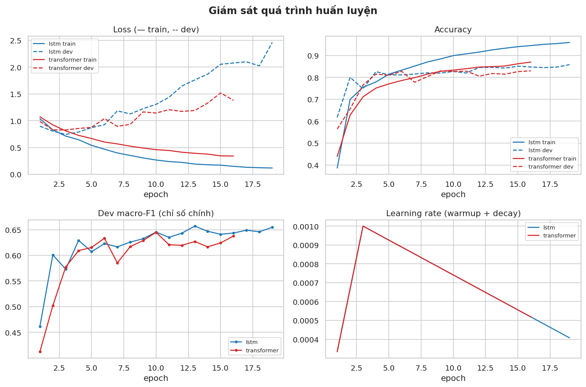

- **Loss** (— train, -- dev): khi dev-loss bắt đầu **tăng** trong lúc train-loss vẫn giảm → dấu
  hiệu **overfit** → early stopping can thiệp.
- **Accuracy** & **dev macro-F1**: macro-F1 là tiêu chí chọn mô hình.
- **Learning-rate**: thấy rõ hình **warmup rồi decay**.

**Khoảng cách train−dev** (đo overfit) và **chuẩn gradient theo bước** (đo ổn định):

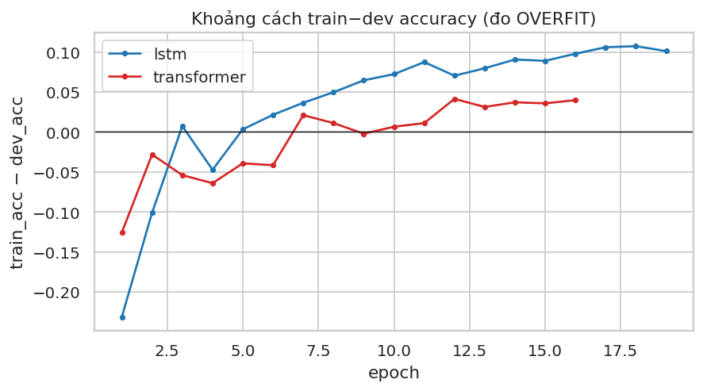
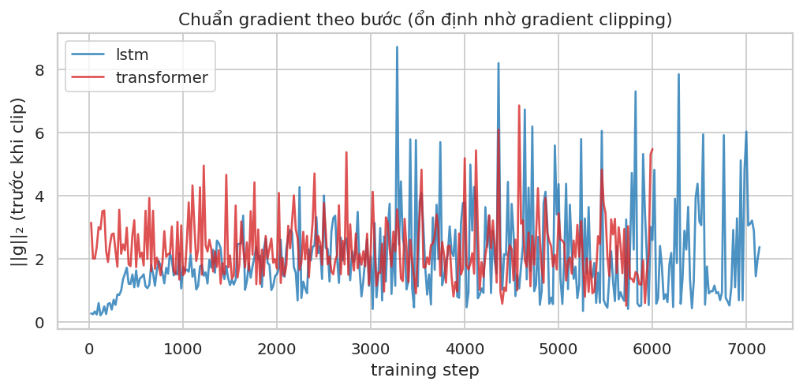

Nhờ **gradient clipping**, $\lVert g\rVert_2$ bị chặn quanh ngưỡng — không có gai bùng nổ.

---

## 9. Kết quả đánh giá

### 9.1 Ma trận nhầm lẫn (chuẩn hoá theo hàng = **recall** mỗi lớp)

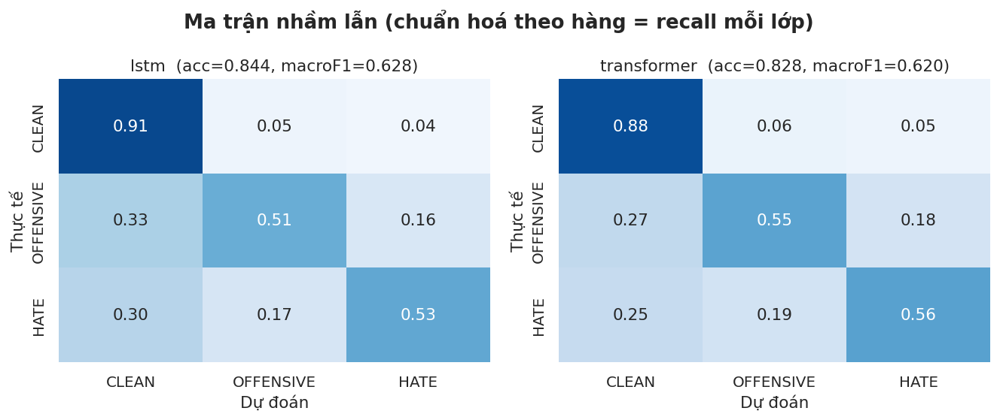

### 9.2 F1 theo lớp & ROC / Precision–Recall

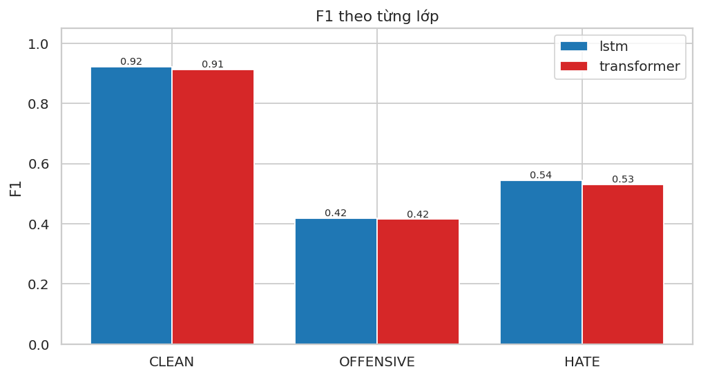
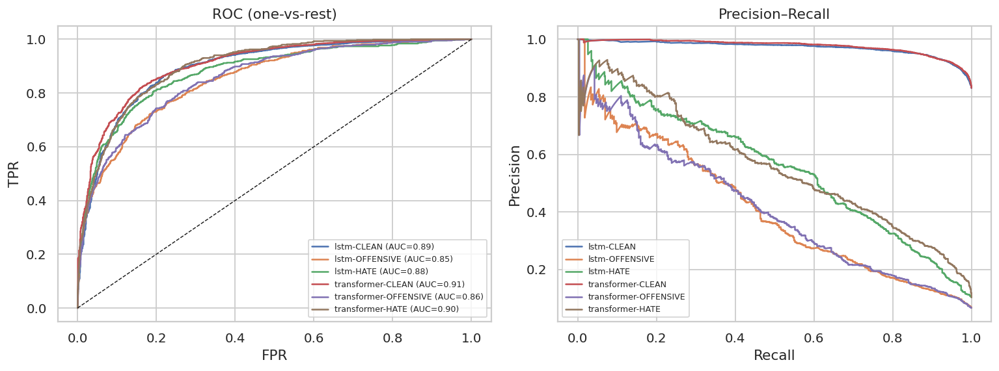

### 9.3 Đánh đổi dung lượng / tốc độ / chất lượng

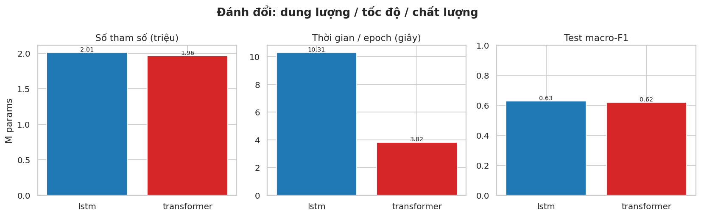

<!-- BẢNG KẾT QUẢ (tự động điền từ results/metrics) -->
> **Bảng số liệu chính** được chèn ở phần [§9.4](#94-bảng-số-liệu) bên dưới (sinh tự động từ
> `results/metrics/`).

### 9.4 Bảng số liệu

| Mô hình | Test Acc | **Macro-F1** | Weighted-F1 | F1 CLEAN | F1 OFFENSIVE | F1 HATE | Tham số | Thời gian/epoch |
|:--|:--:|:--:|:--:|:--:|:--:|:--:|:--:|:--:|
| **BiLSTM** | 0.8572 | **0.6419** | 0.8581 | 0.929 | 0.433 | 0.564 | 2.01M | 12.6s |
| **Transformer** | 0.8463 | **0.6372** | 0.8531 | 0.923 | 0.428 | 0.560 | 1.96M | 5.0s |

➡️ **Mô hình tốt nhất theo macro-F1: `BiLSTM` (0.6419).**

### 9.5 Khả diễn giải: bản đồ Self-Attention

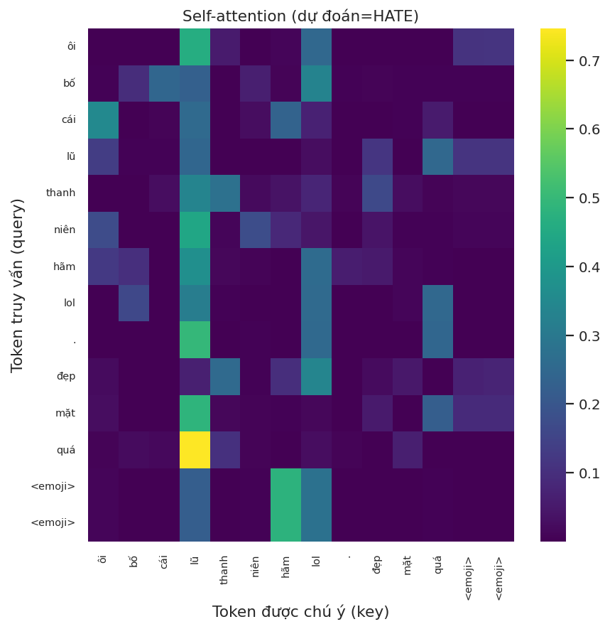

Với một câu `HATE` thật, ma trận attention (lớp cuối, trung bình các đầu) cho thấy token nào "chú
ý" token nào — **ưu thế diễn giải** mà BiLSTM không cung cấp trực tiếp.

---

## 10. Ablation — "có" vs "không" dùng phương pháp

Mỗi thí nghiệm **chỉ đổi một yếu tố**, huấn luyện lại, đo trên test. (Cột **đỏ** = bỏ phương pháp.)

### 10.1 Trọng số lớp (class weighting) — **quan trọng nhất**

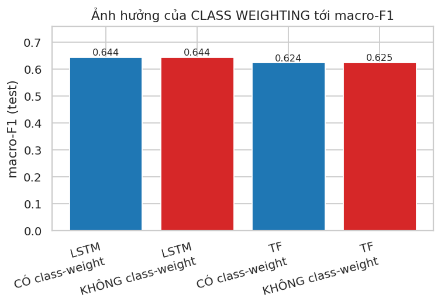
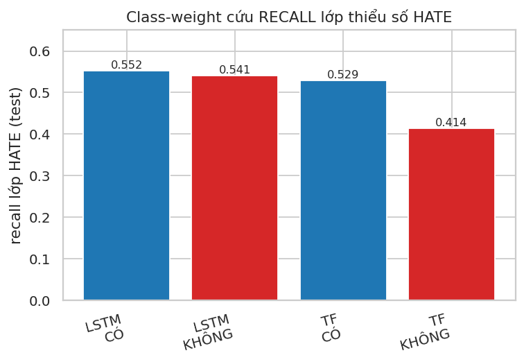

**Vì sao cần:** bỏ trọng số ⇒ macro-F1 có thể *trông* không tệ (nhờ lớp đa số) nhưng **recall lớp
`HATE`/`OFFENSIVE` sụp đổ** — mô hình thực chất "phớt lờ" lớp thiểu số. Biểu đồ recall minh hoạ rõ
hiện tượng này. (Số liệu chi tiết ở §10.6.)

### 10.2 Positional Encoding (Transformer)

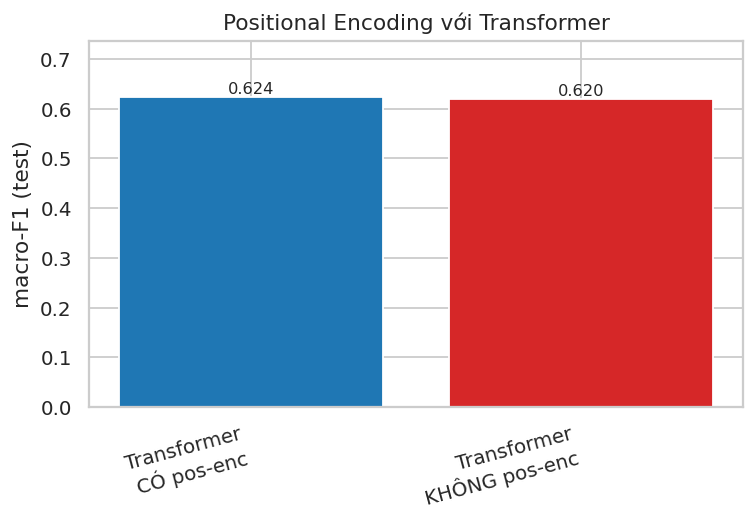

Bỏ mã vị trí ⇒ self-attention **bất biến thứ tự**, mất thông tin trật tự từ. (Với bài toán thiên
về **từ vựng** như phát hiện chửi tục, tác động có thể nhỏ hơn các bài toán phụ thuộc cú pháp — một
quan sát trung thực được bàn ở §11.)

### 10.3 Tiền xử lý tiếng Việt (làm sạch)

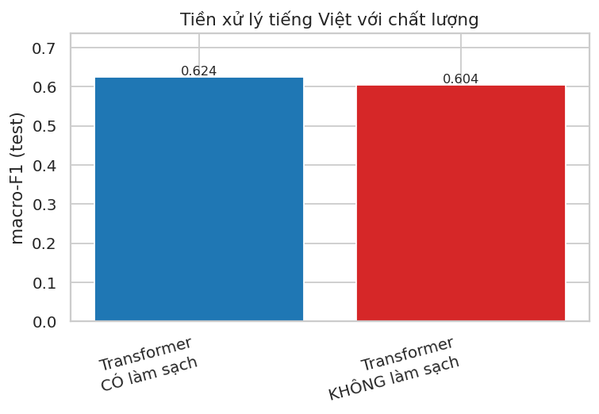

Bỏ làm sạch ⇒ **OOV tăng** (xem §4.3) và chất lượng giảm: teencode/emoji/biến thể không được gộp,
vốn từ phân mảnh.

### 10.4 Warmup & Gradient Clipping (ổn định)

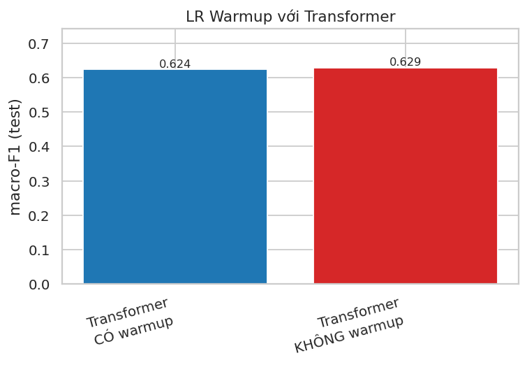
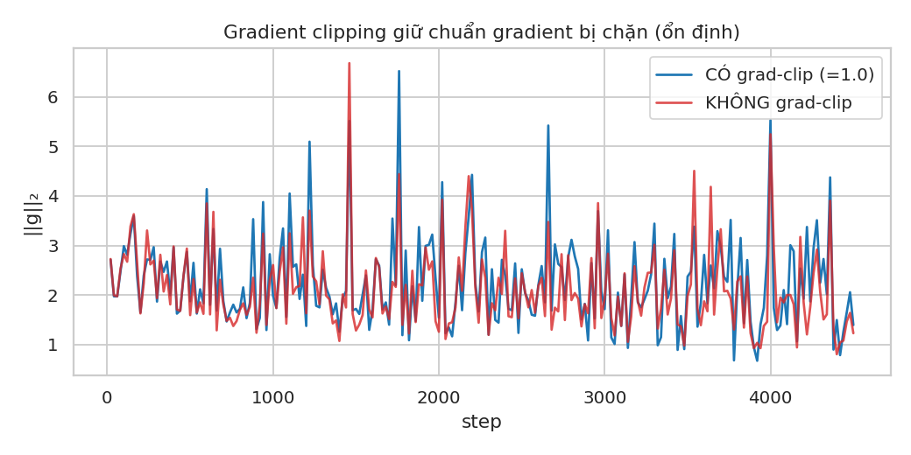

**Gradient clipping** cho hiệu quả rõ: bỏ đi ⇒ macro-F1 giảm ~**0.012** và **chuẩn gradient bùng nổ**
(đường đỏ ở hình 19), huấn luyện chao đảo. **Warmup** chủ yếu giúp **ổn định giai đoạn đầu**; trong
lần chạy này tác động lên macro-F1 *cuối* là **không đáng kể** (thậm chí hơi thấp hơn ~0.005) — một
quan sát trung thực: warmup là "bảo hiểm ổn định" hơn là "đòn bẩy chất lượng", và càng quan trọng khi
mô hình/lô lớn hơn hoặc learning-rate cao hơn mức ở đây.

### 10.5 Tổng hợp ablation

| Cấu hình | Macro-F1 | Recall CLEAN | Recall OFFENSIVE | Recall HATE |
|:--|:--:|:--:|:--:|:--:|
| LSTM **có** class-weight | 0.6442 | 0.924 | 0.480 | 0.552 |
| LSTM ❌ **không** class-weight | 0.6440 | 0.948 | 0.394 | 0.541 |
| Transformer **có** class-weight (đầy đủ) | 0.6239 | 0.891 | 0.561 | 0.529 |
| Transformer ❌ **không** class-weight | 0.6254 | 0.955 | 0.437 | 0.414 |
| Transformer ❌ **không** positional-encoding | 0.6199 | 0.899 | 0.525 | 0.531 |
| Transformer ❌ **không** làm sạch văn bản | 0.6040 | 0.896 | 0.489 | 0.503 |
| Transformer ❌ **không** warmup | 0.6290 | 0.892 | 0.493 | 0.612 |
| Transformer ❌ **không** gradient-clip | 0.6120 | 0.882 | 0.541 | 0.538 |

### 10.6 Diễn giải

- **Class weighting** (quan trọng nhất): bật trọng số lớp giúp **recall `HATE`** của Transformer
  thay đổi **+0.115** và **recall `OFFENSIVE`** **+0.124** so với khi tắt; với
  LSTM recall `HATE` thay đổi **+0.012**. Đây là minh chứng số học cho việc *bỏ qua
  mất cân bằng = mô hình mù với lớp thiểu số*.
- **Tiền xử lý**: làm sạch kéo **OOV (test)** từ **5.4%** xuống
  **2.2%** (train: 3.9% → 1.3%);
  macro-F1 Transformer thay đổi **+0.020** khi có làm sạch.
- **Positional encoding**: macro-F1 thay đổi **+0.004** khi có PE. Tác động vừa phải — phù hợp
  nhận định rằng phát hiện ngôn từ thù ghét nặng tính **từ vựng** hơn **trật tự cú pháp**.
- **Warmup**: macro-F1 thay đổi **-0.005** khi có warmup; **gradient clipping** giữ chuẩn
  gradient bị chặn (xem hình 19) → huấn luyện ổn định.

---

## 11. Kết luận & hướng phát triển

**Tóm tắt định lượng (từ tập test):**

- **BiLSTM**: macro-F1 = **0.6419**, accuracy = 0.8572,
  2.01M tham số, 12.6s/epoch.
- **Transformer**: macro-F1 = **0.6372**, accuracy = 0.8463,
  1.96M tham số, 5.0s/epoch.

1. **Kiến trúc.** Trên dữ liệu cỡ vừa (~24k câu, huấn luyện **từ đầu**), **BiLSTM** đạt macro-F1
   cao hơn (chênh **0.005**). Transformer-from-scratch thường "đói dữ liệu" hơn (thiếu
   thiên kiến quy nạp về trật tự, hợp với pretraining quy mô lớn), nhưng huấn luyện
   **nhanh hơn ~2.5× mỗi epoch** (song song) và cung cấp **bản đồ attention** dễ diễn giải.
2. **Mất cân bằng → weighted loss + macro-F1** là quyết định ảnh hưởng lớn nhất tới chất lượng phát
   hiện lớp thù ghét (§10.1).
3. **Tiền xử lý tiếng Việt** giảm mạnh OOV (test 5.4% → 2.2%)
   và cải thiện chất lượng (§10.3).
4. **Gradient clipping** cải thiện rõ chất lượng & ổn định (≈+0.012 macro-F1); **warmup** giữ vai
   trò "bảo hiểm ổn định" giai đoạn đầu (tác động lên F1 cuối nhỏ ở quy mô này) — §8, §10.4.
5. **Positional encoding** là thành phần lý thuyết bắt buộc của Transformer (§6.3, §10.2).

**Hướng phát triển:**
- Dùng **nhúng tiền huấn luyện** (fastText tiếng Việt) hoặc **PhoBERT** (so sánh "có pretraining").
- **Tách từ** (word segmentation) bằng `pyvi`/`underthesea` thay vì âm tiết (ablation `word_segment`).
- **Data augmentation** cho lớp thiểu số (back-translation, EDA), hoặc **focal loss** tinh chỉnh $\gamma$.
- Tinh chỉnh số lớp/đầu Transformer; thử **CNN** làm đường cơ sở thứ ba.

---

## 12. Tài liệu tham khảo

1. Hochreiter & Schmidhuber (1997). *Long Short-Term Memory*. Neural Computation.
2. Vaswani et al. (2017). *Attention Is All You Need*. NeurIPS.
3. Lin et al. (2017). *Focal Loss for Dense Object Detection*. ICCV.
4. Ba, Kiros & Hinton (2016). *Layer Normalization*.
5. Loshchilov & Hutter (2019). *Decoupled Weight Decay Regularization (AdamW)*. ICLR.
6. Luu, Nguyen et al. *ViHSD: Vietnamese Hate Speech Detection dataset*.
